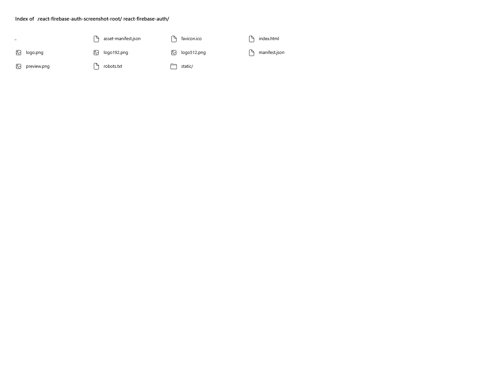

# React Firebase Auth

A responsive React authentication example powered by Firebase Authentication. It includes registration, login, password reset and a protected dashboard route.

## Features

- Firebase email and password registration and login
- Password reset flow with clear success and error states
- Protected dashboard route with sign-out confirmation
- Responsive fixed header, icon-only footer and accessible navigation
- Floating go-to-top control with smooth scrolling
- GitHub Pages deployment configuration

## Tech stack

React, Create React App, Firebase Authentication, React Router, Material UI, Sass and react-icons.

## Firebase setup

Create a Firebase project and enable Email/Password Authentication. Add these values to a local .env file using the REACT_APP_ prefix:

REACT_APP_apiKey
REACT_APP_authDomain
REACT_APP_projectId
REACT_APP_storageBucket
REACT_APP_messagingSenderId
REACT_APP_appId

## Run locally

npm install
npm start

Build and deploy:

npm run build
npm run deploy

## Deployment

Live: https://a2rp.github.io/react-firebase-auth/

## Links

- Portfolio: https://www.ashishranjan.net/
- GitHub: https://github.com/a2rp
- CodePen: https://codepen.io/ash1198
- LinkedIn: https://www.linkedin.com/in/aashishranjan
- Facebook: https://www.facebook.com/theash.ashish/
- YouTube: https://www.youtube.com/@ashishranjan-ashz?sub_confirmation=1
- Email: mailto:ash.ranjan09@gmail.com

## Support

- Support: https://a2rp-donation-page.netlify.app/
- Buy Me a Coffee: https://buymeacoffee.com/a2rp
- Patreon: https://patreon.com/a2rp
